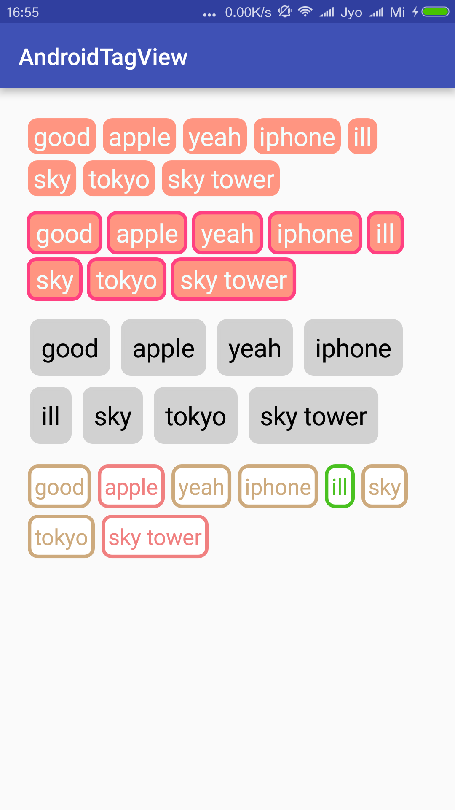

AndroidTagView
=======

android的云标签。
参考了网上的几个开源项目。

            

示例如下：

  		<com.ginsmile.androidtagview.HotTagView
                android:id="@+id/htv2"
                android:layout_below="@id/htv"
                android:padding="5dp"
                android:layout_width="match_parent"
                android:layout_height="wrap_content"
                app:text_size="8sp"
                app:text_color="#F1FFFF"
                app:stroke_width="3dp"
                app:line_color="@color/colorAccent"
                app:background_color="@color/colorPink"
                app:textview_padding_left="8dp"
                app:textview_padding_right="8dp"
                app:textview_padding_top="4dp"
                app:textview_padding_bottom="4dp"
                app:textview_margin_left="2dp"
                app:textview_margin_right="2dp"
                app:textview_margin_top="2dp">
            </com.ginsmile.androidtagview.HotTagView>
            
            
解释：

* app:text_size="8sp" 文字大小
* app:text_color="#F1FFFF" 文字颜色
* app:stroke_width="3dp" 边框宽度
* app:line_color="@color/colorAccent" 边框颜色
* app:background_color="@color/colorPink" 每个小TagView的背景色
* app:textview_padding="8dp" 每个小TagView里面文字的Padding，**不能和以下四个同时使用**
* app:textview_padding_left="8dp" 每个小TagView里面文字的PaddingLeft
* app:textview_padding_right="8dp"
* app:textview_padding_top="4dp"
* app:textview_padding_bottom="4dp"
* app:textview_margin="2dp" 每个TagView的Margin，**不能和以下四个同时使用**
* app:textview_margin_left="2dp" 每个TagView的MarginLeft
* app:textview_margin_right="2dp"
* app:textview_margin_top="2dp"
* app:textview_margin_bottom="2dp"

参考资料： 

* https://github.com/2dxgujun/AndroidTagGroup
* http://www.imooc.com/learn/237